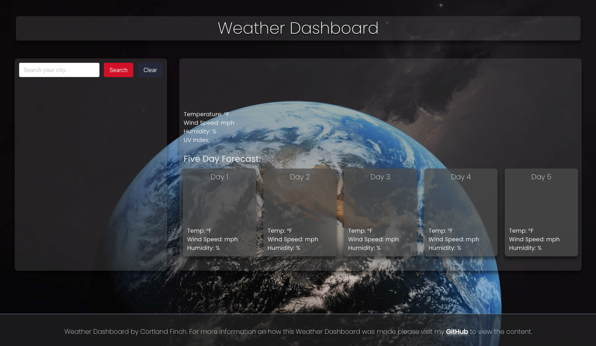

# Weather Dashboard

## Purpose
This weather dashboard allows users to search for any city of their choosing. Once the user searches their city they will be presented the current weather conditions and future weather conditions. This dashboad will show users the city name, date, temperature, humidity, wind speed, and uv index. Based on the weather conditions of the city the user will be indicated whether the conditions are favorable, moderate or severe. 

## Link to the Weather Dashboard
Link to website: 
https://github.com/cortlandfinch/day-after-tomorrow

**screen shot of dashboard
